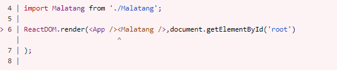
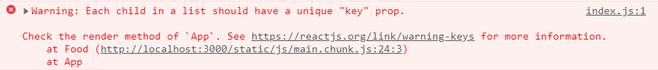

## ✔ 리액트 만들기
    $ npm install -g create-react-app
    $ create-react-app my-app


## ✔ import
```js
import React from 'react' // 필수
```


##  ✔ Component 
- HTML을 반환하는 함수
- 대문자로 시작해야 정보를 보낼 수 있다.  

```js
<App />
```
 ```js
function App() {} // function 컴포넌트
class App extends React.Component {} // class 컴포넌트
```

<!-- HTML과 javascript 사이의 조합을 jsx라 부른다.  -->
## ✔ jsx
- jacascript 안에 있는 HTML ( HTML+ jacascript)
- component에 정보를 보낼 수 있다.

## ✔ props 
- 컴포넌트 끼리 값을 전달하는 수단

## ✔ state
- object
- 쓰는 이유 : 컴포넌트의 데이터를 넣을 곳간이 있고 그 데이터는 동적인(변하는) 데이터 


## ✔ map()
- 반복함수 
- map이 하는것은 rendering
- map은 array의 각 item에서 function을 실행하는 array를 가지는 
javascript function이며 그 function의 result를 갖는 array를 나에게 줌 
___

> ####  👁‍🗨 내가 전달받은 props가 내가 원하는 props인지 확인하기 👁‍🗨
     npm i prop-types 
- 
___


### 1. Error
Malatang.js


> 리액트 어플리케이션은 하나(&lt;App /&gt;)의 컴포넌트만을 렌더링 해야하기 떄문에 마라탕은 에러 💥


### 1.1 Solution

> &lt;App /&gt; 안에 &lt;Malatang /&gt; 넣기 

### 2. Error

> list안의 child는 unique한 key prop을 가져야 한다. 
즉, 모든 react의 element들은 유일해야한다.
근데 list안으로 집어 넣을때 유일성을 잃어버림 

### 1.1 Solution
> item들에게 각각 id 주기 -> 컴포넌트에 prop(key)을 주기  

    
```js
Props.js

 const foodLike = [
   {
     id : 1, // 이렇게 아이디 주기 
     name: "malatang",
     imot : "🥣"
   },

   {
     id : 2, // 이렇게 !
     name: "naicha",
     imot : "🧃"
   },

   <Food key={dish.id} // 컴포넌트에 prop(key)을 주기  
```
___


######
🍓**rfce**🍓

